# Section2 神になる
## 目次

[1.光あれ](#1光あれ)

[2.天地創造](#2天地創造)

## 1.光あれ
まだここには何もありません。まずは世界を創造していきましょう。

右上の新規作成をクリックして自分の世界を作りましょう。

作成をクリックしてあなたの世界を創造します。

そうするとこのような画面が出てくると思います。
ここが今からあなたが作り出す世界です。

## 2.天地創造
世界には大地が必要です。世界に大地を設置するには3種類の方法があります。

Terrainが世界に生成されました。
この大地は500m×500mの広大な大地です。
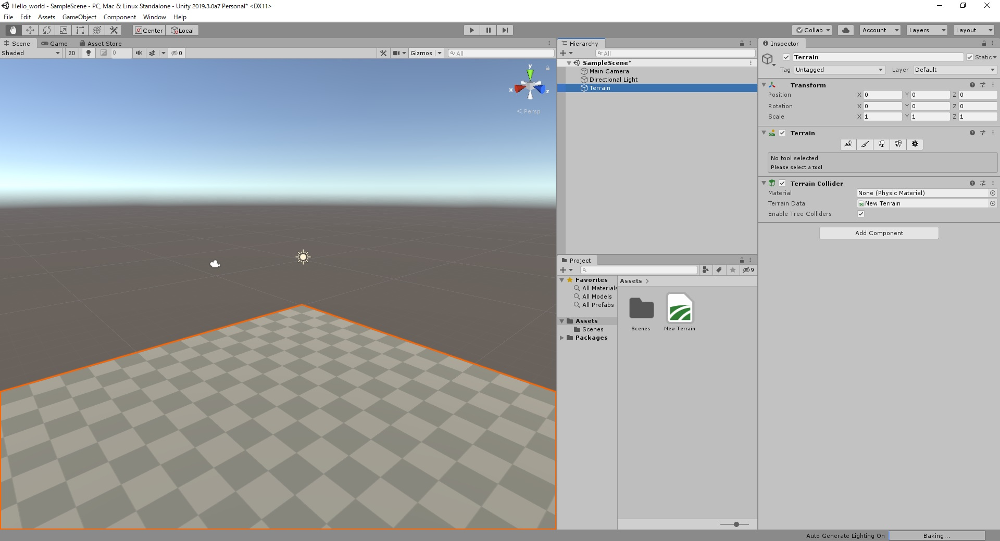

***

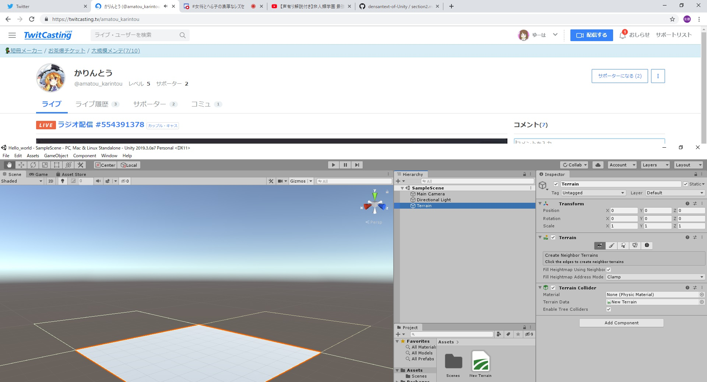
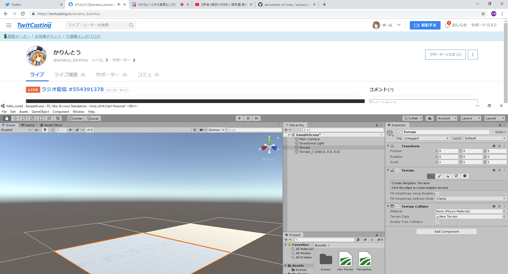
土地を広げることができる。

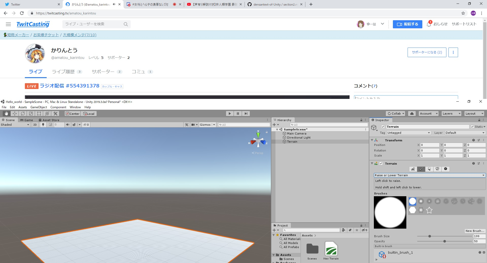
これは地形を盛り上げたり下げたりするものです。

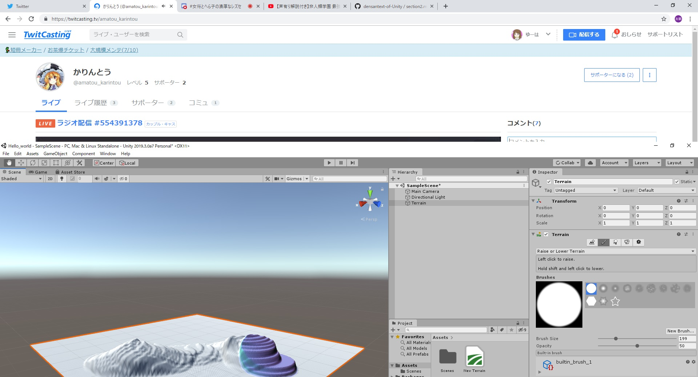
terrainでドラッグすると地形が盛り上がります。

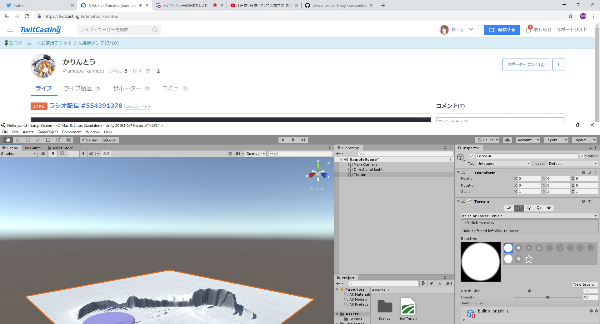
shiftを押しながらドラッグすると下がっていきます。

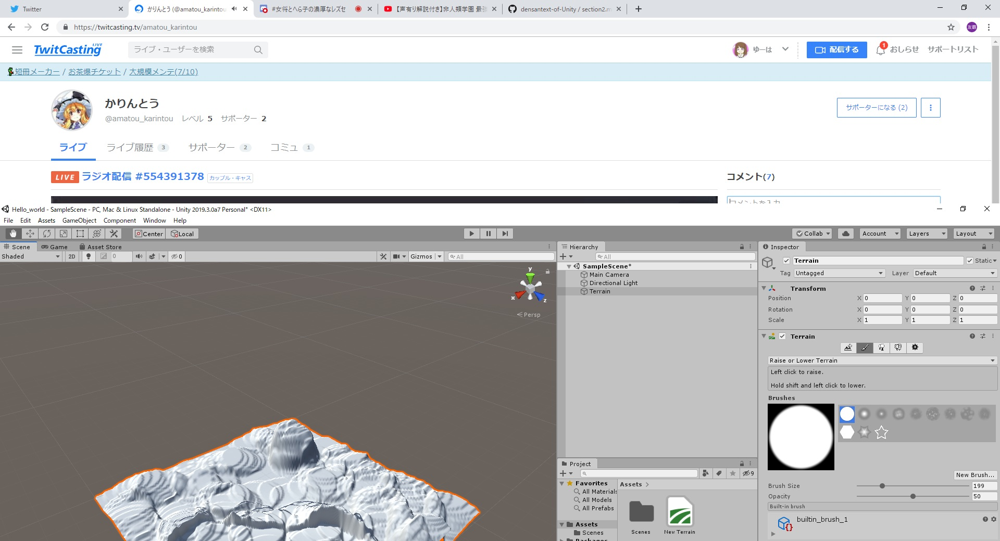
こんな感じになりました。

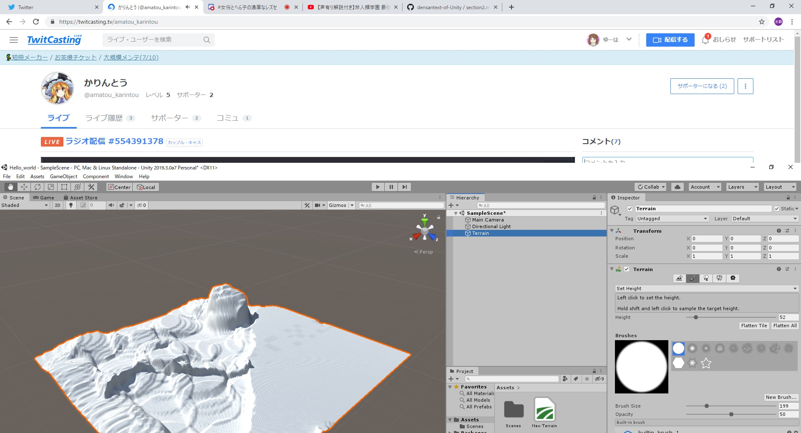
これは地形を平坦にするツールです。

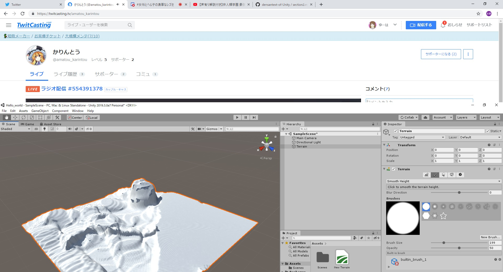
これは地形を滑らかにするツールです。

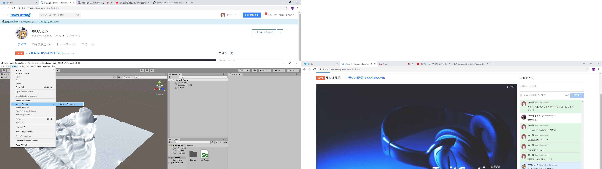
スタンダードアセットをimportします。

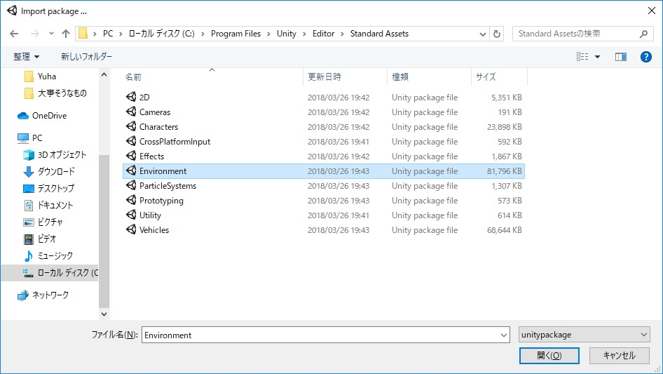
ここにあります。

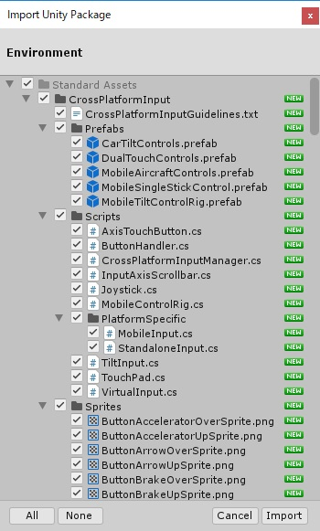
全部importしときます。

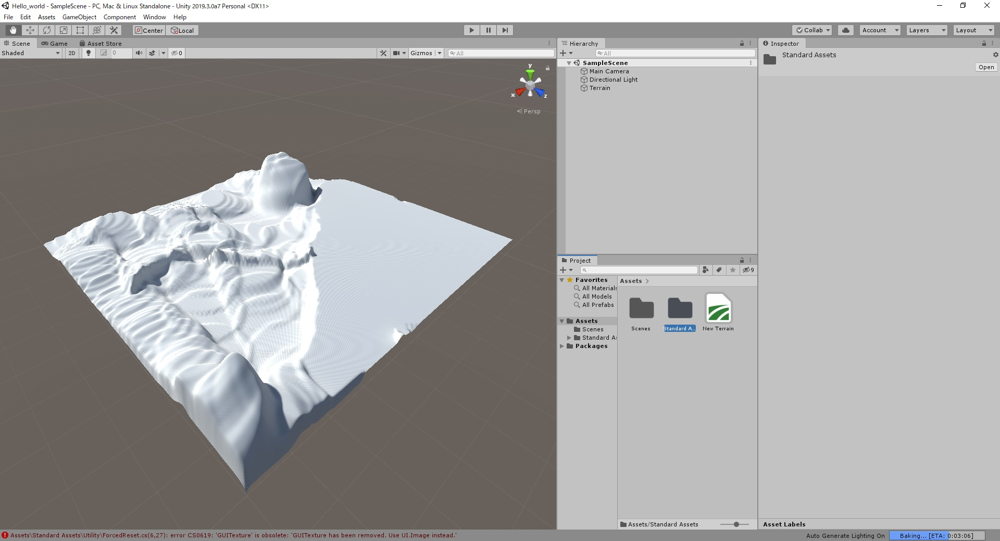
できました。

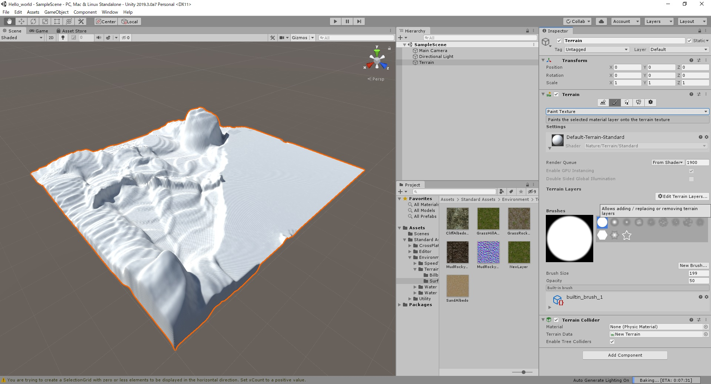
ここでtextureを張れるようになります。

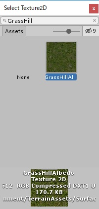
これを選択します。

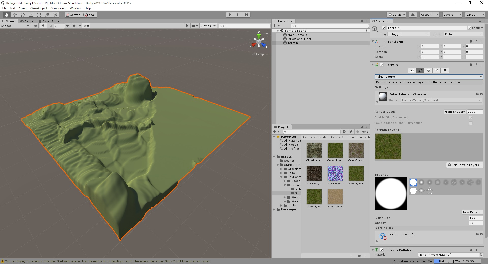
textureが貼られました。

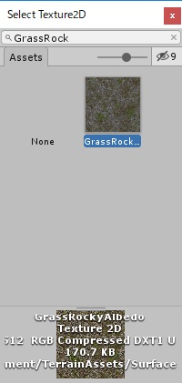
これをAddします。

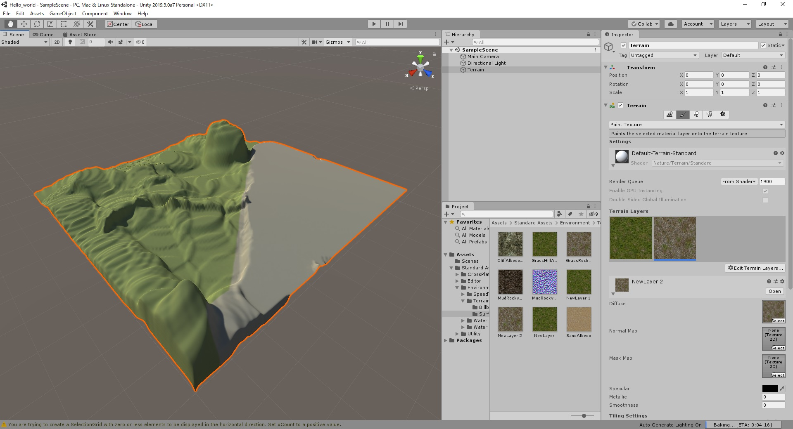
色塗りできました。

