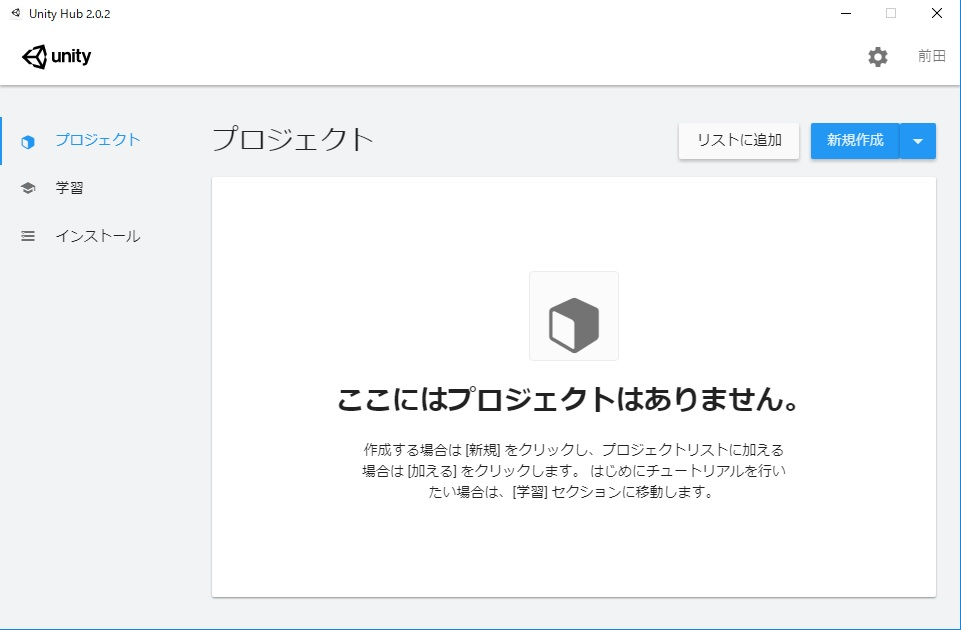
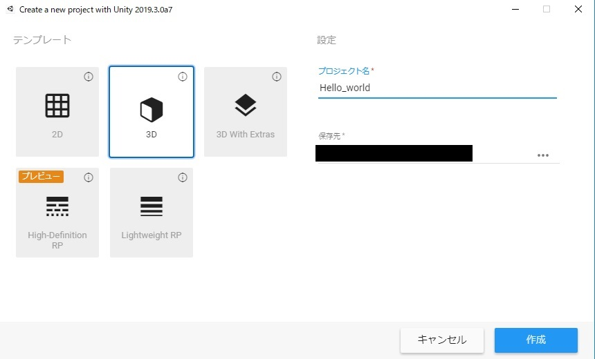
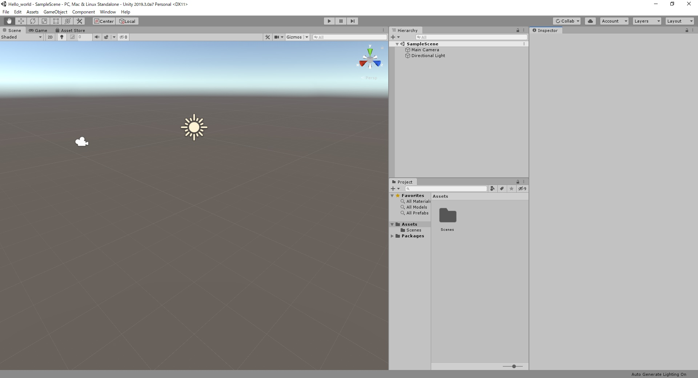
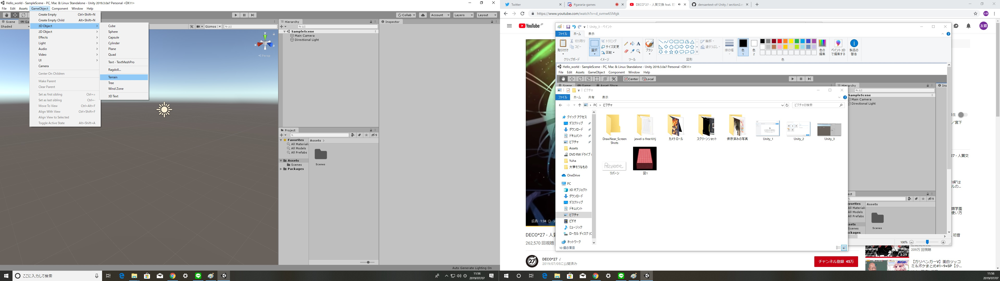
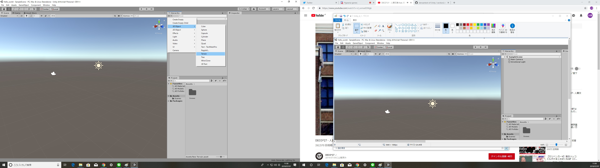
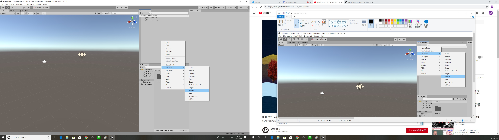

# Section2 神になる
## 目次

[1.光あれ](#1光あれ)
## 1.光あれ
まだここには何もありません。まずは世界を創造していきましょう。

右上の新規作成をクリックして自分の世界を作りましょう。

作成をクリックしてあなたの世界を創造します。

そうするとこのような画面が出てくると思います。
ここが今からあなたが作り出す世界です。

## 2.天地創造
世界には大地が必要です。世界に大地を設置するには3種類の方法があります。

Terrainが世界に生成されました。
この大地は500m×500mの広大な大地です。
